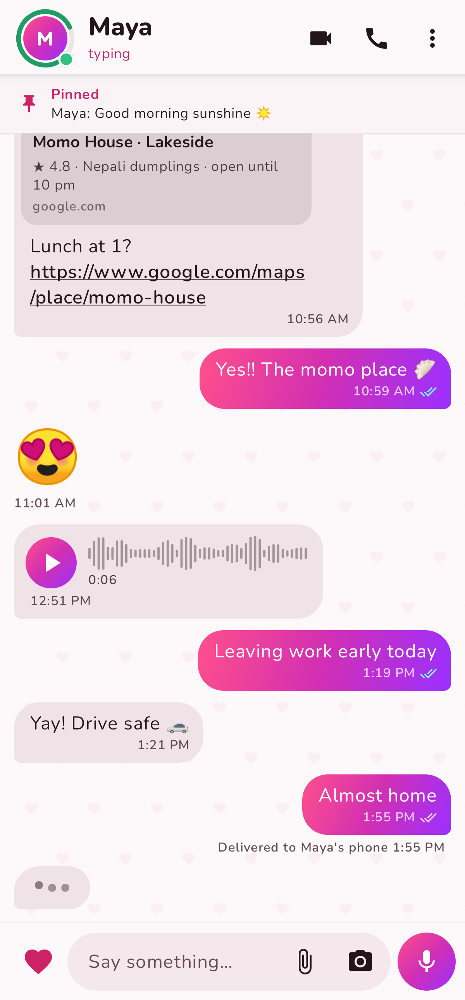
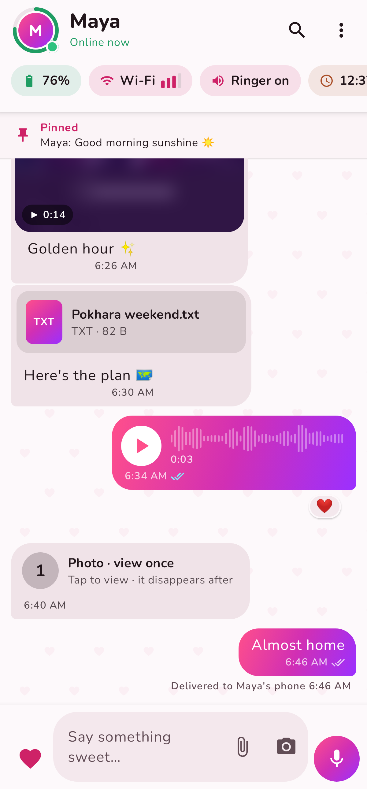
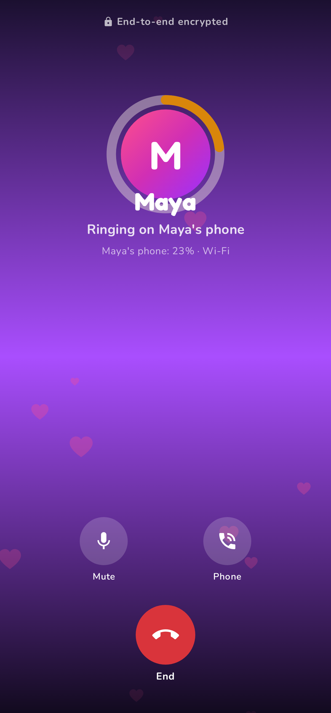
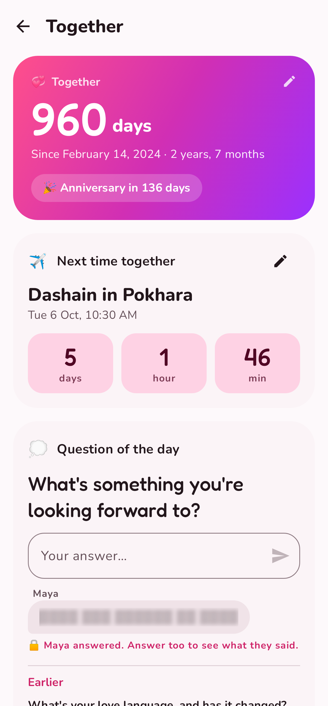

# MaMi

A private messenger for couples. Two people, one encrypted conversation, and
enough context about each other's phone that nobody has to guess why the other
one went quiet.

<p align="center">
  
  
  
  
</p>

More in [`docs/screenshots/`](docs/screenshots). CI renders them from the
real Compose screens on every push.

## What it does today (Android, first test release)

- **Sign in with email.** A 6-digit code, no password.
- **Pairing.** One partner creates an invite (optionally locked to the other's
  email address), the other enters the code. After that the two accounts are
  linked; either one can unlink at any time, which deletes the conversation on
  both phones.
- **End-to-end encryption.** Every phone creates its own keys. Messages, read
  receipts, typing and device status are encrypted on the phone with the
  Double Ratchet (Olm, via the audited `vodozemac` library). The server only
  relays ciphertext. Partners can compare a safety code to rule out a
  man-in-the-middle, and are warned when the other's keys change.
- **Four honest message states**: still on my phone → reached MaMi → reached
  their phone → seen, each with an exact timestamp (tap a message).
- **Partner status, shared two-way and opt-in**: battery and charging,
  Wi-Fi/mobile data and signal, silent/vibrate/Do Not Disturb, local time,
  plus a status you set yourself ("🚗 Driving for 1 hour"). You only see what
  you share too.
- **"Why are they quiet?" hints**: phone probably died (it was at 4% and went
  silent), probably asleep (it's 2 am there), on silent, weak signal, last
  seen.
- **Dying-battery alert**: the phone tells the partner automatically at 5%.
- **Typing indicator, presence, "thinking of you" nudges** (hug, kiss, miss
  you) with their own notification channel.
- **Photos, videos, voice messages and files.** From the gallery or camera,
  with captions and **view once** (screenshots blocked). Hold the mic to
  record, slide to cancel; voice messages show a waveform and play at 1×,
  1.5× or 2×. Everything is encrypted on the phone before it's uploaded and
  deleted from the server once the partner has it.
- **Link previews**, made on the sender's phone, so the server never learns
  which links you share.
- **Reply** (swipe right), **reactions**, **edit**, **unsend for both**,
  **pin for both**, **star**, copy, save and share.
- **Search** through the whole conversation (on the phone only), and
  **Media, links and files**: Photos, Videos, Voice, Links and Files tabs by
  month, with a full-screen viewer.
- **Voice and video calls** over the internet, end-to-end encrypted. They ring
  full screen even when the app is closed, show when it's actually ringing on
  your partner's phone and their battery, and support mute,
  speaker/Bluetooth, camera flip, a floating window (picture-in-picture) and
  call history in the chat.
- **Together**, a page that's just the two of you:
  - **days together** since the day you set, and the countdown to your
    anniversary;
  - **the next time you'll meet**, counting down in days, hours and minutes;
  - **mood check-ins** with a note, and the last seven days of both moods;
  - **love letters** on paper you pick, in handwriting, optionally sealed
    until a date; the envelope opens when it's read;
  - **"Home safe", "Leaving now" and "Arrived"** in one tap;
  - **live location** for 15 minutes, an hour or 8 hours, end-to-end
    encrypted: how far apart you are, which way, moving or not, and Open in
    Maps;
  - **scheduled messages**, picked on your partner's clock when you're in
    different time zones; they stay a surprise until their time;
  - **pause sharing** for an hour, until morning or until you resume: your
    partner sees "Sharing paused" instead of a phone that seems dead.
- **Automatic statuses** (opt-in): "🚗 Driving" while your phone notices
  you're in a car, and "Woke up" the first time you use it in the morning.
- **Privacy**: keys sealed by the Android Keystore, no cloud backups, optional
  hidden notification text, content-free push notifications.

## Debug builds: skip anything, try everything

Debug APKs talk to the real server, but they also carry a **demo mode**: a
simulated partner ("Maya") who lives on the phone. In demo mode the whole app
works with no server and no second phone.

- **Skip ›** in the top corner of every sign-in and setup step jumps ahead
  (and switches to demo mode).
- In demo mode any email and code work (`000000` shows the error state), and
  Maya accepts a new invite after a few seconds.
- Maya replies to your messages, and you can watch each message go
  sending → sent → delivered → seen.
- The draggable **🐞** button opens the playground:
  - jump straight to any screen;
  - switch between the real server and demo mode (it remembers your choice);
  - control Maya's phone: online, battery and charging, Wi-Fi or data,
    signal, silent/Do Not Disturb, time zone, status;
  - set off events: a message, a nudge, a dying-battery alert, Maya's phone
    dying, night time, a key change, losing the connection;
  - have Maya send a photo, a view-once photo, a voice message, a video, a
    PDF or a link, react to your message, edit, unsend or pin hers;
  - have Maya call you (voice or video), hang up, drop her connection or
    turn her camera off;
  - fill the Together page, and have Maya check in a mood, send a (sealed)
    letter, say she's home safe, share her live location as she walks,
    schedule a surprise, pause sharing, drive or wake up;
  - change the colour theme and dark mode;
  - start over.

Release builds have none of this.

## Repository layout

| Path | What |
|---|---|
| [`core/`](core) | Rust library shared by Android now and iOS later: keys, encrypted sessions, the message format, sharing rules and the partner hints. Exported to Kotlin/Swift with UniFFI. |
| [`server/`](server) | Rust relay server (axum + SQLite): sign-in, pairing, public-key directory, encrypted message queue, receipts, presence, push. |
| [`android/`](android) | The Android app (Kotlin, Jetpack Compose). |
| [`docs/`](docs) | [Protocol](docs/PROTOCOL.md), [roadmap](docs/ROADMAP.md). |

## Getting a test build

Every push builds a debug APK on GitHub Actions (**Actions → CI → Artifacts →
`mami-debug-apk`**). Testers install it by allowing "install unknown apps".

For that APK to work outside an emulator, point it at your server: set the
repository variable **`MAMI_SERVER_URL`** (Settings → Secrets and variables →
Actions → Variables), for example `https://mami.example.com`. Debug builds also
let testers change the server address on the sign-in screen.

Push notifications need Firebase: add the contents of your
`google-services.json` as the repository secret **`GOOGLE_SERVICES_JSON`**
(see [`android/README.md`](android/README.md)). Without it the app still
works, but messages arrive only while the app is open or on the 15-minute
background refresh.

## Running everything locally

```sh
# Core and server tests
cargo test --workspace

# Server (sign-in codes are printed to the log until SMTP is configured)
cargo run -p mami-server

# Android app (needs the Android SDK + NDK, Rust, and `cargo install cargo-ndk`)
cd android && ./gradlew installDebug
```

See [`server/README.md`](server/README.md) to deploy the server and
[`android/README.md`](android/README.md) for app setup.
